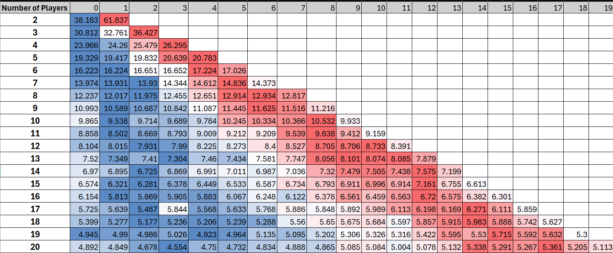
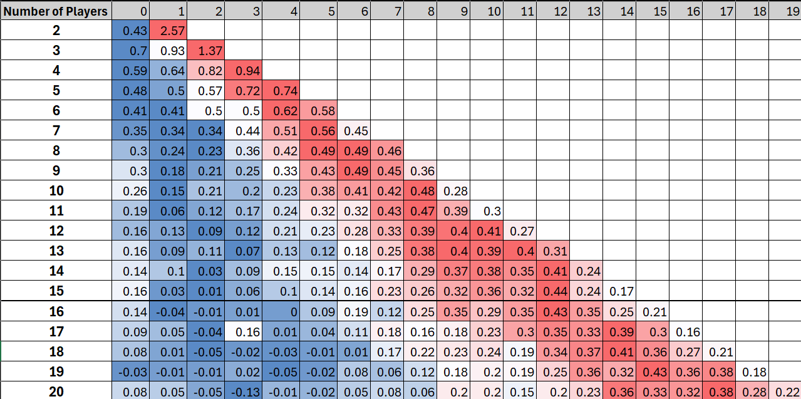

# Left Right Center Game Simulation

## Rules of Left Right Center
Left Right Center (LRC) is a dice game of luch, but you can increase your chances depending on where you sit.

1. **Setup**:
   - Each player starts with a set number of tokens (or cash, chips, etc.).
   - Players sit in a circle.

2. **Dice**:
   - LRC uses special dice with the following sides:
     - **L**: Pass one token to the player on your left.
     - **R**: Pass one token to the player on your right.
     - **C**: Place one token in the center pot.
     - **Dot (•)**: Keep your token (on 3 sides).

3. **Gameplay**:
   - Players take turns rolling 1–3 dice (depending on the number of tokens they have).
   - The number of dice rolled equals the number of tokens the player holds (up to 3).
   - After rolling, follow the dice outcomes (L, R, C, or Dot).
   - A player without tokens cannot roll but can rejoin the game if they receive a token from another player.

4. **Winning**:
   - The game ends when only one player has tokens left.
   - The last player wins the pot.

---

## Simulation Results
For the simulation I simulated 100,000 games for a different number of players involved. For each sim, each player started with 3 tokens/dollars.

### Metrics:
- **Win Percentages**: The likelihood of each player winning, based on their position (player 0 acts first).
- **Expected Earnings**: Average earnings per game for each player across all simulations.

### Heatmaps:

*A heatmap showing the win percentage for each player*

*A heatmap showing the expected earnings for each player*

---

  
